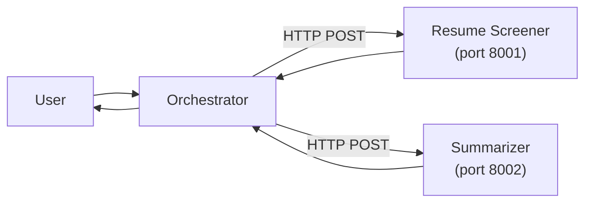

Analyze this plan:

---
name: Agent Platform Learning Plan
overview: A hands-on, progressive curriculum for building an agent orchestration platform from scratch. Each step introduces a concept, explains why it matters, gives you exercises to write yourself, and uses the resume screener agent as the running example throughout.
todos:
  - id: step-1
    content: "Step 1: Build the raw agentic loop — resume screener agent with tool calling, PDF parsing, candidate scoring"
    status: pending
  - id: step-2
    content: "Step 2: Multi-agent handoff — resume screener + summarizer + orchestrator communicating over HTTP"
    status: pending
  - id: step-3
    content: "Step 3: Minimal platform backend — agent registry, task routing, Postgres persistence, Next.js chat UI"
    status: pending
  - id: step-4
    content: "Step 4: Async + long-running workflows — Celery then Temporal for batch resume screening with crash recovery"
    status: pending
  - id: step-5
    content: "Step 5: Tracing and observability — OpenTelemetry + Langfuse for LLM call tracing, cost tracking, debugging"
    status: pending
  - id: step-6
    content: "Step 6: Evals — test dataset, scoring script, CI integration, A/B prompt testing"
    status: pending
  - id: step-7
    content: "Step 7: IAM and multi-tenancy — JWT auth, workspaces, API keys, role-based access control"
    status: pending
isProject: false
---

# Build an Agent Orchestration Platform — Learning Curriculum

## Starting Point

You already have a working reference implementation in this repo:

- `[agent.py](agent.py)` — agentic loop with tool calling
- `[tools.py](tools.py)` — tool definitions + dispatcher
- `[guardrails.py](guardrails.py)` — input/output validation
- `[server.py](server.py)` — FastAPI wrapper
- `[evals.py](evals.py)` — evaluation suite

You'll keep this as reference, but build the new platform in a fresh directory structure. The resume screener agent will be your test case at every step.

---

## New Project Structure (what you'll build)

```
platform/
  docker-compose.yml
  backend/                  # Step 3+: Platform backend
    app/
      main.py               # FastAPI app
      models.py             # SQLAlchemy / Pydantic models
      db.py                 # Postgres connection
      routes/
        agents.py           # Agent registry CRUD
        tasks.py            # Task submission + routing
      services/
        agent_runner.py     # Runs agent via HTTP (ACP-style)
        task_service.py     # Task lifecycle management
  agents/
    resume_screener/        # Step 1+: Your main agent
      agent.py              # Raw agentic loop
      tools.py              # fetch_jd, parse_pdf, score_resume
      server.py             # Step 2+: FastAPI ACP server
    orchestrator/           # Step 2: Multi-agent router
      agent.py
      server.py
    summarizer/             # Step 2: Simple sub-agent
      agent.py
      server.py
  frontend/                 # Step 3+: Next.js app
  workers/                  # Step 4: Celery/Temporal workers
```

---

## Step 1: The Raw Agentic Loop

### Concept

The agentic loop is the heartbeat of every AI agent. It's a `while` loop that sends messages to an LLM, detects tool-call requests in the response, executes the tools locally, feeds results back, and repeats until the model returns a final text answer.

### What breaks without this?

Without the loop, you get a single LLM call that can only answer from its training data. The loop gives agents the ability to *act* — to call APIs, read files, query databases, and compose multi-step reasoning.

### Key concepts to understand

- **OpenAI function calling protocol**: The model doesn't execute tools. It returns a JSON object saying "I want to call function X with args Y." Your code executes it and sends the result back as a `tool` message.
- `**finish_reason`**: The API tells you *why* the model stopped. `"tool_calls"` means it wants to use a tool. `"stop"` means it's done talking.
- **Message list as memory**: The conversation array *is* the agent's memory. Every tool call and result gets appended. The model sees the full history on every turn.

### Your reference

Your existing `[agent.py](agent.py)` lines 100-148 implement exactly this pattern. Study it, then close the file and rebuild it from scratch for the resume screener.

### Exercises (write these yourself)

**1a. Bare-bones loop (no tools)**

Create `agents/resume_screener/agent.py`. Write a function that:

- Takes a user message string
- Builds a message list with a system prompt for resume screening
- Calls the OpenAI API once
- Returns the response text

This establishes the simplest possible LLM interaction. Run it and verify it works.

**1b. Add tool definitions**

Create `agents/resume_screener/tools.py`. Define three tools using the OpenAI function-calling JSON schema format:

- `fetch_job_description(url: str)` — For now, return a hardcoded JD string
- `parse_pdf(file_path: str)` — For now, read a `.txt` file and return its contents (you'll add real PDF parsing later with `PyMuPDF` or `pdfplumber`)
- `score_candidate(name: str, jd: str, resume_text: str)` — This is interesting: it can be a *nested LLM call* that scores a single candidate. Or start simple and make it rule-based.

Write a `TOOLS` list (the JSON schema definitions) and an `execute_tool(name, params)` dispatcher function, modeled on your existing `[tools.py](tools.py)` pattern.

**1c. Wire up the loop**

Now add the `while` loop to your agent. The loop should:

1. Call the API with tools enabled
2. Check `finish_reason == "tool_calls"`
3. For each tool call: parse the function name and args, execute via your dispatcher, append the tool result
4. Call the API again with the updated conversation
5. Repeat until `finish_reason == "stop"`

**1d. Test it end-to-end**

Create a `test_files/` directory with:

- `sample_jd.txt` — A job description
- `resume_alice.txt`, `resume_bob.txt` — Two fake resumes

Run your agent with: "Score the candidates in the test_files directory against the job description in sample_jd.txt"

Verify the agent calls tools in sequence (fetch JD, parse each resume, score).

**1e. Add real PDF parsing**

Install `pdfplumber` (add it to your `requirements.txt`). Update `parse_pdf` to handle actual `.pdf` files. Create a sample PDF resume and test again.

### Checkpoint: What you should understand after Step 1

- How the OpenAI function-calling protocol works at the message level
- Why the loop is necessary (multi-step reasoning)
- The difference between tool *definitions* (JSON schema) and tool *implementations* (Python functions)
- How the message list grows during a multi-tool run

---

## Step 2: Multi-Agent Handoff

### Concept

A single agent can only do what its tools allow. Real-world tasks often need *specialist* agents — one that's great at parsing documents, another that summarizes, another that scores. An **orchestrator** agent decides which specialist to call based on the task.

### What breaks without this?

Without a communication protocol between agents, you'd have to cram every capability into one giant agent with 50 tools. The system prompt becomes unmanageable, tool selection gets unreliable, and you can't scale teams of people working on different agents.

### Architecture




Each agent runs as its own FastAPI server with a standard endpoint (`POST /run`). The orchestrator calls them over HTTP. This is the embryonic version of what Agentex calls the **Agent Communication Protocol (ACP)**.

### Exercises

**2a. Turn the resume screener into a server**

Create `agents/resume_screener/server.py`:

- A FastAPI app with `POST /run` that accepts `{"message": "..."}` and returns `{"response": "..."}`
- Internally calls your agent loop from Step 1
- Run it on port 8001

**2b. Build a summarizer agent**

Create `agents/summarizer/` with its own `agent.py` and `server.py`:

- System prompt: "You are a document summarizer. Given text, produce a concise summary."
- No tools needed — just a single LLM call
- `POST /run` on port 8002

**2c. Build the orchestrator**

Create `agents/orchestrator/agent.py` and `server.py`:

- Define a tool called `call_agent(agent_name: str, message: str)` that makes an HTTP POST to the appropriate agent's `/run` endpoint
- The orchestrator's system prompt tells it which agents are available and what they do
- The tool implementation is a simple `httpx.post()` to the right URL
- Maintain a hardcoded registry dict: `{"resume_screener": "http://localhost:8001", "summarizer": "http://localhost:8002"}`

**2d. Test the full flow**

Start all three servers (three terminal tabs). Send a request to the orchestrator: "Screen the resumes in test_files against the JD." Verify it delegates to the resume screener.

Then try: "Summarize the job description in test_files/sample_jd.txt." Verify it routes to the summarizer.

**2e. Feel the pain**

Notice what's fragile:

- Hardcoded URLs — what if an agent moves?
- No health checking — what if an agent is down?
- No standard request/response format — what if agents need different schemas?

This pain motivates Step 3 (a central registry) and is why Agentex built ACP.

### Checkpoint: What you should understand after Step 2

- Why agents need a communication protocol
- How HTTP-based agent-to-agent calls work
- Why a registry/router is necessary
- The orchestrator pattern (an agent whose "tools" are other agents)

---

## Step 3: Minimal Platform Backend

### Concept

Instead of hardcoding agent URLs, build a central platform that agents register with. The platform accepts tasks from users, looks up the right agent, and routes the request.

### What breaks without this?

Without a central backend: no agent discovery, no task history, no way for a UI to interact with agents, no audit trail.

### Key components to build

- **Agent registry** — Postgres table: `agents(id, name, description, url, status, created_at)`
- **Task table** — `tasks(id, agent_id, input, output, status, created_at, completed_at)`
- **Message history** — `messages(id, task_id, role, content, tool_calls_json, created_at)`

### Exercises

**3a. Set up Postgres with Docker**

Create a `docker-compose.yml` at the project root with a Postgres service. Use `psycopg2` or `asyncpg` + SQLAlchemy for the ORM.

**3b. Build the platform backend**

Create `backend/app/main.py` (FastAPI app) with these routes:

- `POST /agents/register` — Agent calls this on startup with `{name, description, url}`
- `GET /agents` — List all registered agents
- `POST /tasks` — User submits `{agent_name, input}`. Backend looks up agent, creates task record, calls agent's `/run` endpoint, saves response, returns result.
- `GET /tasks/{id}` — Get task with full message history

Use SQLAlchemy models in `backend/app/models.py` and a DB session in `backend/app/db.py`.

**3c. Add self-registration to your agents**

Modify each agent's `server.py` lifespan to call `POST /agents/register` on the platform backend at startup (like Agentex does — see the registration pattern: name, description, URL, retry with backoff).

**3d. Build a minimal chat UI**

Create `frontend/` with Next.js:

- A page that lists available agents (from `GET /agents`)
- A chat interface that sends messages to `POST /tasks` and displays the response
- Show task history from `GET /tasks/{id}`

Keep the UI simple — a sidebar with agent list, main panel with chat.

**3e. Persist message history**

Update the agent loop to emit messages back to the platform (or have the platform capture them). Store every message (user, assistant, tool calls, tool results) in the `messages` table so you can replay any task.

### Checkpoint: What you should understand after Step 3

- Why a central registry solves the hardcoding problem
- How task lifecycle works (created -> running -> completed/failed)
- How message history enables debugging and replay
- The relationship between agents (compute) and the platform (coordination)

---

## Step 4: Async + Long-Running Workflows

### Concept

Some tasks take minutes or hours (screening 50 resumes). You can't hold an HTTP connection open that long. You need: (1) accept the task, return immediately with a task ID, (2) process in the background, (3) let the client poll or subscribe for updates.

### What breaks without this?

HTTP timeouts kill long-running tasks. Server restarts lose in-progress work. Users have no visibility into progress.

### Exercises

**4a. Celery + Redis (starter async)**

Add Redis to your `docker-compose.yml`. Install Celery. Create a Celery task that wraps your agent's `run` function. Update `POST /tasks` to enqueue instead of calling synchronously. Add `GET /tasks/{id}/status` for polling.

**4b. Batch resume screening**

Modify the resume screener to accept a directory path and process *all* resumes in it. Each resume is a sub-task. Store intermediate results. Verify that if you kill the worker mid-run and restart it, the incomplete resumes get retried.

**4c. Temporal (durable execution)**

Add Temporal to Docker Compose (see Agentex's compose file as reference — it runs `temporalio/auto-setup` with its own Postgres). Replace the Celery task with a Temporal workflow:

- Workflow: `screen_resumes(jd_path, resume_dir)` — loops through resumes
- Activity: `score_single_resume(jd_text, resume_path)` — scores one resume

Temporal automatically retries failed activities and resumes workflows after crashes. Kill the worker mid-batch and watch it recover.

**4d. Progress streaming**

Add Server-Sent Events (SSE) to the platform so the UI can show real-time progress: "Scored 12/50 resumes..."

### Checkpoint: What you should understand after Step 4

- Why async task processing is necessary for production agents
- The difference between Celery (task queue) and Temporal (workflow engine)
- What "durable execution" means concretely (crash recovery, retries, workflow state)
- How SSE enables real-time UI updates

---

## Step 5: Tracing and Observability

### Concept

When an agent takes 45 seconds and costs $0.30, you need to know *exactly* what happened: which tools were called, how long each LLM call took, how many tokens were consumed, and where time/money was spent.

### What breaks without this?

You can't debug agent failures. You can't optimize cost. You can't tell if an agent is getting worse over time.

### Exercises

**5a. Manual tracing first**

Before adding any framework, instrument your agent loop manually. At the start of each LLM call, record `time.time()`. After, record the duration and token counts from the response. Log structured JSON: `{"event": "llm_call", "duration_ms": 1200, "tokens_prompt": 450, "tokens_completion": 120, "model": "gpt-4o-mini"}`. Do the same for tool executions.

**5b. OpenTelemetry instrumentation**

Install `opentelemetry-api` and `opentelemetry-sdk`. Create spans for:

- The full agent run (parent span)
- Each LLM call (child span with token attributes)
- Each tool execution (child span with tool name)

Export to console first, then to Jaeger (add to Docker Compose).

**5c. Langfuse integration**

Self-host Langfuse via Docker Compose. Use the Langfuse Python SDK to wrap your OpenAI calls. This gives you a UI to browse traces, see token usage, latency breakdowns, and cost per run.

**5d. Platform-level dashboards**

Add a `/traces` route to the platform backend that queries Langfuse or your trace store. Show in the UI: per-task trace timeline, cost breakdown, error rate.

### Checkpoint: What you should understand after Step 5

- What a "trace" and "span" are in the context of agent execution
- How to calculate cost from token counts
- How to find the bottleneck in a slow agent run
- The value of a trace UI for debugging production issues

---

## Step 6: Evals

### Concept

Evals answer: "Is this agent actually good?" For the resume screener, that means: does it rank candidates correctly? Does it explain its reasoning? Does it handle edge cases?

### What breaks without this?

You change a prompt and have no idea if the agent got better or worse. You're flying blind.

### Exercises

**6a. Build a test dataset**

Create 10 resume/JD pairs with *known correct rankings* (you decide the ground truth). Store as JSON fixtures.

**6b. Write a scoring script**

Write `evals/resume_screener_eval.py` that:

- Runs the agent on each test case
- Compares the agent's ranking to your ground truth
- Computes metrics: rank correlation (Kendall's tau), top-3 precision, average reasoning quality (you can use an LLM-as-judge for this)

**6c. Run evals in CI**

Make the eval script exit with code 1 if metrics drop below thresholds. Run it after every change. This is your regression test.

**6d. A/B prompt testing**

Write a harness that runs the same test cases with two different system prompts and compares scores. This is how you iterate on prompts scientifically instead of vibes.

### Checkpoint: What you should understand after Step 6

- Why "it seems to work" is not sufficient for production agents
- How to design test cases with ground truth
- Rank correlation metrics for ranking tasks
- LLM-as-judge for evaluating reasoning quality

---

## Step 7: IAM and Multi-Tenancy

### Concept

Multiple customers use the same platform. Each customer has their own agents, tasks, and data. They must not see each other's data.

### What breaks without this?

Customer A sees Customer B's resumes. A leaked API key compromises everyone.

### Exercises

**7a. JWT authentication**

Add `python-jose` and `passlib`. Create:

- `POST /auth/register` — email + password, returns JWT
- `POST /auth/login` — returns JWT
- A `get_current_user` dependency that validates the JWT on every request

**7b. Workspaces**

Add a `workspaces` table. Every agent, task, and API key belongs to a workspace. Add `workspace_id` as a foreign key to your existing tables. All queries filter by the current user's workspace.

**7c. API key management**

Add `POST /api-keys` (create), `GET /api-keys` (list), `DELETE /api-keys/{id}` (revoke). API keys are an alternative to JWTs for programmatic access.

**7d. Role-based access**

Add roles: `owner`, `admin`, `member`, `viewer`. Owners can delete the workspace. Admins can manage agents. Members can create tasks. Viewers can only read.

### Checkpoint: What you should understand after Step 7

- JWT-based authentication flow
- Workspace-scoped multi-tenancy (shared database, scoped queries)
- API key management for machine-to-machine auth
- Role-based access control patterns

---

## How to Use This Plan

- Work through steps sequentially — each one builds on the last
- At each step, **write the code yourself first** before looking at your existing reference code in this repo
- When you get stuck, ask me specific questions ("How does the OpenAI tool calling protocol handle parallel tool calls?")
- After each step, **test by hand** and make sure things work before moving on
- Keep the resume screener as your constant test case — it should get more capable at each step

## Recommended Reading Before Starting

- [OpenAI Function Calling docs](https://platform.openai.com/docs/guides/function-calling) — the protocol you're building on
- [FastAPI Tutorial](https://fastapi.tiangolo.com/tutorial/) — your HTTP framework
- [Temporal Python SDK docs](https://docs.temporal.io/develop/python) — for Step 4
- [Agentex GitHub](https://github.com/scaleapi/scale-agentex) — the architecture reference

